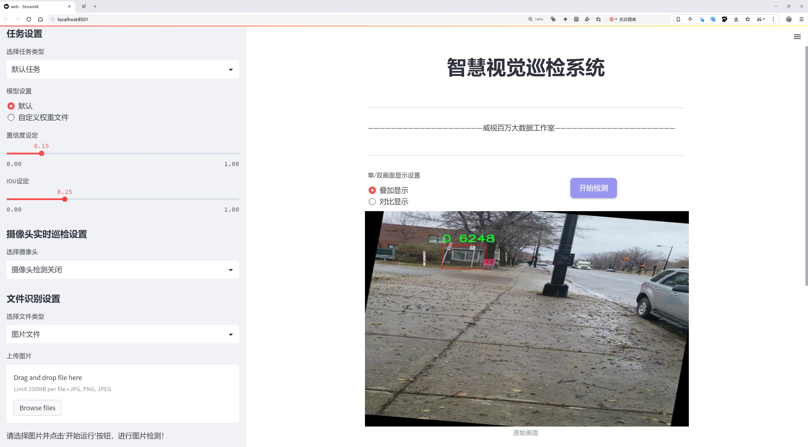
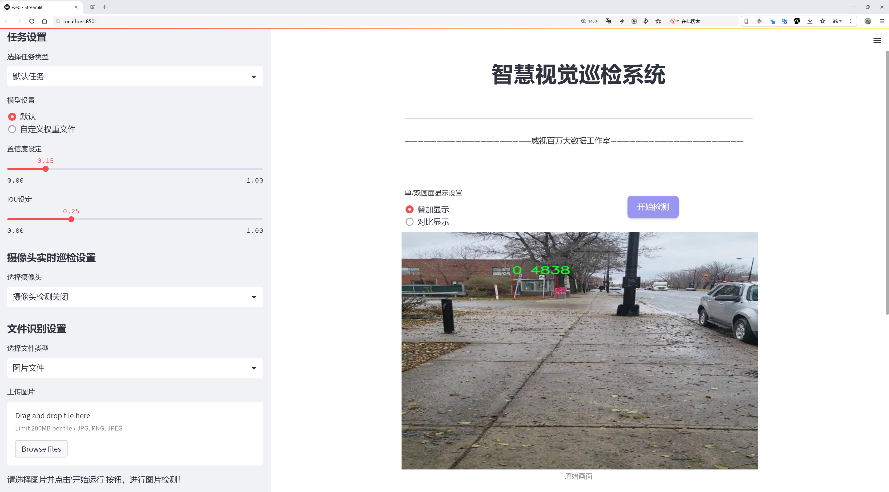
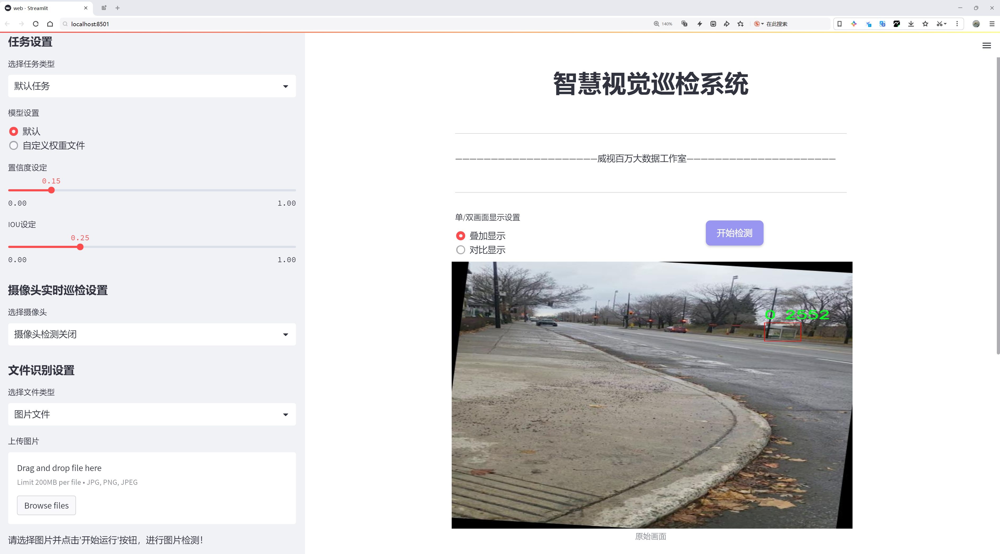
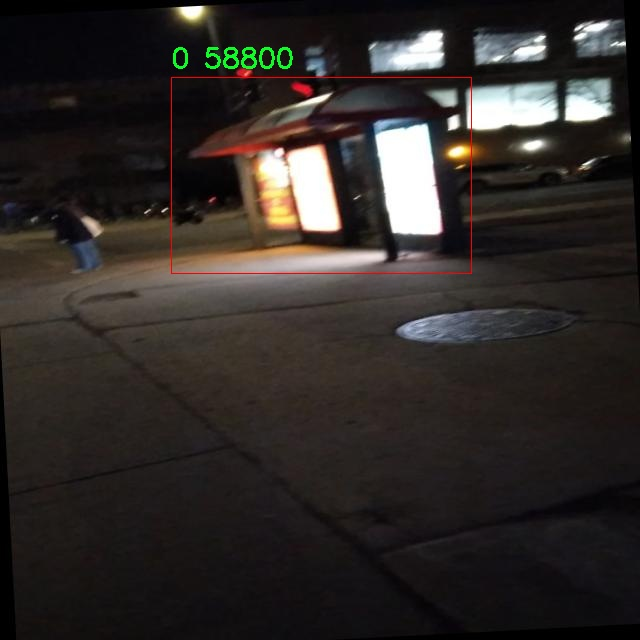
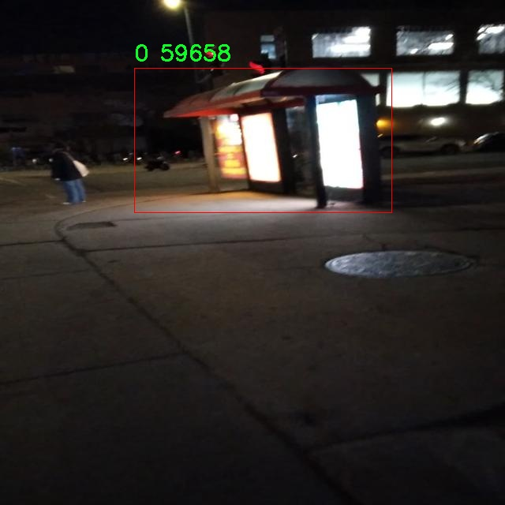
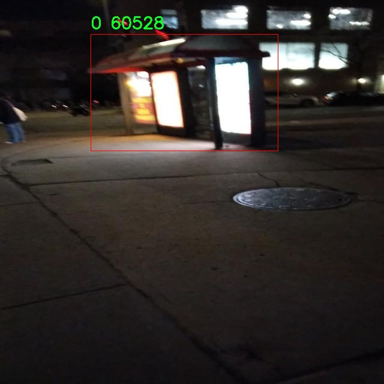
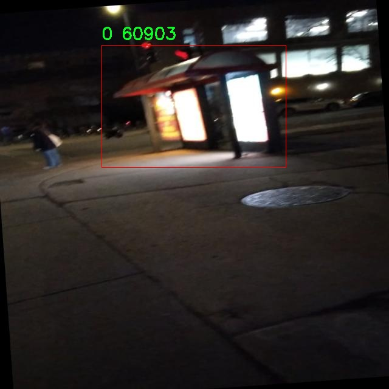

# 公交候车亭检测检测系统源码分享
 # [一条龙教学YOLOV8标注好的数据集一键训练_70+全套改进创新点发刊_Web前端展示]

### 1.研究背景与意义

项目参考[AAAI Association for the Advancement of Artificial Intelligence](https://gitee.com/qunshansj/projects)

项目来源[AACV Association for the Advancement of Computer Vision](https://gitee.com/qunmasj/projects)

研究背景与意义

随着城市化进程的加快，公共交通系统在城市交通中扮演着越来越重要的角色。公交候车亭作为公共交通系统的重要组成部分，不仅为乘客提供了候车的便利，也在城市景观中占据着重要的位置。然而，传统的公交候车亭管理和维护方式往往依赖人工巡查，效率低下且容易出现漏检现象。因此，开发一种高效、智能的公交候车亭检测系统显得尤为重要。

近年来，深度学习技术的迅猛发展为目标检测领域带来了革命性的变化。YOLO（You Only Look Once）系列模型因其高效的实时检测能力和良好的准确性，成为了目标检测的主流方法之一。YOLOv8作为该系列的最新版本，进一步提升了检测精度和速度，适合于实时监控和智能交通系统的应用。然而，现有的YOLOv8模型在特定场景下的应用仍然存在一定的局限性，尤其是在复杂环境下的公交候车亭检测任务中。因此，基于改进YOLOv8的公交候车亭检测系统的研究具有重要的理论和实践意义。

本研究所使用的数据集包含1700张公交候车亭的图像，涵盖了多种不同的拍摄角度和光照条件。这一数据集的构建为模型的训练和验证提供了坚实的基础。通过对该数据集的深入分析，我们可以识别出公交候车亭在不同环境下的特征，从而为模型的改进提供数据支持。尤其是在城市中，公交候车亭的外观可能因环境变化而有所不同，因此，利用丰富的图像数据进行模型训练，将显著提高检测系统的鲁棒性和适应性。

在技术层面，改进YOLOv8模型将涉及多个方面的优化，包括特征提取网络的改进、损失函数的调整以及数据增强技术的应用等。这些改进不仅能够提升模型在公交候车亭检测任务中的准确性，还能加快其推理速度，使其能够满足实时检测的需求。此外，通过引入迁移学习等先进技术，可以有效地利用已有的知识，提高模型在小样本数据集上的表现。

从社会意义上看，基于改进YOLOv8的公交候车亭检测系统的实现，将有助于提升城市公共交通管理的智能化水平。通过自动化的检测系统，相关部门可以及时发现和处理公交候车亭的损坏、缺失等问题，从而提高公共交通服务的质量和效率。同时，该系统的推广应用也将为城市管理者提供科学的决策依据，促进城市交通的可持续发展。

综上所述，基于改进YOLOv8的公交候车亭检测系统的研究，不仅具有重要的学术价值，也对实际应用具有深远的影响。通过该研究，我们希望能够为城市公共交通的智能化管理提供新的思路和解决方案，为提升城市居民的出行体验贡献力量。

### 2.图片演示







##### 注意：由于此博客编辑较早，上面“2.图片演示”和“3.视频演示”展示的系统图片或者视频可能为老版本，新版本在老版本的基础上升级如下：（实际效果以升级的新版本为准）

  （1）适配了YOLOV8的“目标检测”模型和“实例分割”模型，通过加载相应的权重（.pt）文件即可自适应加载模型。

  （2）支持“图片识别”、“视频识别”、“摄像头实时识别”三种识别模式。

  （3）支持“图片识别”、“视频识别”、“摄像头实时识别”三种识别结果保存导出，解决手动导出（容易卡顿出现爆内存）存在的问题，识别完自动保存结果并导出到tempDir中。

  （4）支持Web前端系统中的标题、背景图等自定义修改，后面提供修改教程。

  另外本项目提供训练的数据集和训练教程,暂不提供权重文件（best.pt）,需要您按照教程进行训练后实现图片演示和Web前端界面演示的效果。

### 3.视频演示

[3.1 视频演示](https://www.bilibili.com/video/BV1Er4neSELB/)

### 4.数据集信息展示

##### 4.1 本项目数据集详细数据（类别数＆类别名）

nc: 1
names: ['0']


##### 4.2 本项目数据集信息介绍

数据集信息展示

在本研究中，我们使用了名为“Bus Shelter”的数据集，以支持对公交候车亭检测系统的改进，特别是针对YOLOv8模型的训练和优化。该数据集专注于公交候车亭这一特定目标，具有单一类别的特点，类别数量为1，类别列表中仅包含一个标识符“0”。这一设计使得数据集在处理公交候车亭检测任务时具有明确的聚焦点，便于模型的训练和性能评估。

“Bus Shelter”数据集的构建旨在为计算机视觉领域的研究者和开发者提供一个高质量的样本库，以便于在不同环境下对公交候车亭进行有效的检测。该数据集包含了多种场景下的公交候车亭图像，涵盖了城市街道、乡村道路以及不同天气条件下的样本。这种多样性确保了模型在实际应用中的鲁棒性和适应性，使其能够在不同的光照、视角和背景下准确识别公交候车亭。

数据集中的图像经过精心挑选和标注，确保每个样本都能清晰地展示公交候车亭的特征。标注过程遵循严格的标准，确保每个图像中的公交候车亭都被准确地框定，以便于后续的训练和测试。通过使用高分辨率的图像，数据集能够提供丰富的视觉信息，帮助模型学习到公交候车亭的细微特征，从而提高检测的准确性。

此外，为了增强模型的泛化能力，数据集还包括了不同类型的公交候车亭设计，如传统的封闭式候车亭、开放式候车亭以及带有广告牌的候车亭。这种多样化的样本不仅丰富了数据集的内容，也为模型提供了更广泛的学习基础，使其能够适应各种实际应用场景。

在训练过程中，研究者可以利用“Bus Shelter”数据集进行数据增强，以提高模型的性能。通过旋转、缩放、裁剪和颜色变换等技术，研究者能够生成更多的训练样本，从而进一步提升模型的鲁棒性和准确性。这种数据增强策略能够有效防止模型过拟合，确保其在面对新数据时仍能保持良好的检测能力。

总之，“Bus Shelter”数据集为公交候车亭检测系统的研究提供了坚实的基础。其丰富的样本、多样的场景以及高质量的标注，确保了模型在训练过程中的有效性和可靠性。通过对该数据集的深入分析和利用，研究者能够不断优化YOLOv8模型，使其在公交候车亭检测任务中表现出色，为智能交通系统的建设提供有力支持。随着研究的深入，期待该数据集能够为未来的相关研究提供更多的启示和参考，推动公交候车亭检测技术的进一步发展。










### 5.全套项目环境部署视频教程（零基础手把手教学）

[5.1 环境部署教程链接（零基础手把手教学）](https://www.ixigua.com/7404473917358506534?logTag=c807d0cbc21c0ef59de5)


[5.2 安装Python虚拟环境创建和依赖库安装视频教程链接（零基础手把手教学）](https://www.ixigua.com/7404474678003106304?logTag=1f1041108cd1f708b01a)

### 6.手把手YOLOV8训练视频教程（零基础小白有手就能学会）

[6.1 手把手YOLOV8训练视频教程（零基础小白有手就能学会）](https://www.ixigua.com/7404477157818401292?logTag=d31a2dfd1983c9668658)

### 7.70+种全套YOLOV8创新点代码加载调参视频教程（一键加载写好的改进模型的配置文件）

[7.1 70+种全套YOLOV8创新点代码加载调参视频教程（一键加载写好的改进模型的配置文件）](https://www.ixigua.com/7404478314661806627?logTag=29066f8288e3f4eea3a4)

### 8.70+种全套YOLOV8创新点原理讲解（非科班也可以轻松写刊发刊，V10版本正在科研待更新）

由于篇幅限制，每个创新点的具体原理讲解就不一一展开，具体见下列网址中的创新点对应子项目的技术原理博客网址【Blog】：


[8.1 70+种全套YOLOV8创新点原理讲解链接](https://gitee.com/qunmasj/good)

### 9.系统功能展示（检测对象为举例，实际内容以本项目数据集为准）

图9.1.系统支持检测结果表格显示

  图9.2.系统支持置信度和IOU阈值手动调节

  图9.3.系统支持自定义加载权重文件best.pt(需要你通过步骤5中训练获得)

  图9.4.系统支持摄像头实时识别

  图9.5.系统支持图片识别

  图9.6.系统支持视频识别

  图9.7.系统支持识别结果文件自动保存

  图9.8.系统支持Excel导出检测结果数据


### 10.原始YOLOV8算法原理

原始YOLOv8算法原理

YOLOv8算法是目标检测领域的一项重要进展，承袭了YOLO系列的优良传统，并在此基础上进行了多方面的优化与创新。作为YOLOv5的后续版本，YOLOv8在模型结构、特征提取、数据处理等方面进行了深度改进，以适应更复杂的目标检测任务和多样化的应用场景。

首先，YOLOv8的网络结构由三个主要部分组成：输入端、主干网络和检测头。输入端负责接收图像数据并进行预处理，主干网络则是特征提取的核心，负责从输入图像中提取出有用的特征信息，而检测头则将这些特征信息转化为最终的检测结果。YOLOv8提供了五种不同规模的模型（n、s、m、l、x），以便在不同的硬件条件和应用需求下选择合适的模型。尤其是轻量化的YOLOv8n模型，通过对网络结构的精简与优化，使得其在保持较高检测精度的同时，具备了更快的推理速度和更低的计算资源消耗。

在骨干特征提取网络层，YOLOv8采用了C2F模块来替代YOLOv5中的C3模块。C2F模块的设计理念是通过增加残差连接的数量来丰富梯度信息的流动，从而提升模型的学习能力。C2F模块的卷积操作采用了3×3的卷积核，并将深度设置为3、6、6、3，形成了一种高效的特征提取机制。通过这种设计，YOLOv8能够在更轻量化的基础上，提取出更为丰富的特征信息，为后续的目标检测任务奠定了坚实的基础。

特征融合层是YOLOv8的另一大亮点。该层结合了特征金字塔网络（FPN）和路径聚合网络（PAN），以实现多尺度特征的有效融合。FPN通过构建特征金字塔，使得不同尺度的特征能够在网络中进行充分的交互与融合，而PAN则通过路径聚合的方式，增强了特征的上下文信息。为了进一步提升特征融合的效率，YOLOv8引入了BiFPN网络，该网络的设计旨在实现高效的双向跨尺度连接，并通过加权特征融合来提升不同尺度特征信息的提取速度。这种特征融合策略，使得YOLOv8在处理多尺度目标时，能够更好地捕捉到不同尺度下的特征信息，从而提升了检测的准确性和鲁棒性。

在检测头层，YOLOv8采用了最新的解耦合头结构，将分类和定位任务分开处理。这种解耦合的设计使得模型能够更专注于各自的任务，从而提高了分类和定位的精度。同时，YOLOv8将传统的锚框检测方式替换为无锚框检测（Anchor-Free），这使得模型在处理目标时更加灵活，减少了对锚框设置的依赖，进而提升了检测的效率。

在数据预处理方面，YOLOv8继承了YOLOv5的多种数据增强策略，包括马赛克增强、混合增强、空间扰动和颜色扰动等。这些增强手段不仅能够有效扩充训练数据集的多样性，还能提升模型的泛化能力，使其在实际应用中表现得更加稳健。

YOLOv8在标签分配策略上也进行了创新，采用了动态标签分配策略TOOD。与YOLOv5依赖于聚类候选框的方式不同，YOLOv8通过直接使用目标框和目标分数，避免了因数据集不足而导致的候选框不准确问题。这种策略使得正负样本的匹配更加合理，进一步提升了模型的检测性能。

在损失计算方面，YOLOv8引入了多种损失函数，其中包括BCELoss作为分类损失，DFLLoss和CIoULoss作为回归损失。特别是Varifocal Loss的引入，使得模型在处理正负样本时能够更加灵活地调整损失权重，进而提升了模型对高质量样本的关注度。这种损失函数的设计理念在于，通过对负样本的降权处理，减少其对整体损失的影响，从而使得模型在训练过程中能够更专注于学习高质量的正样本。

综上所述，YOLOv8算法通过在骨干网络、特征融合、检测头、数据增强和损失计算等多个方面的创新与优化，显著提升了目标检测的性能与效率。其轻量化设计使得YOLOv8在各种应用场景中都能表现出色，成为目标检测领域的一项重要工具。随着YOLOv8的推广与应用，目标检测技术将迎来新的发展机遇，为各类智能应用提供更为强大的支持。


### 11.项目核心源码讲解（再也不用担心看不懂代码逻辑）

#### 11.1 code\ultralytics\trackers\utils\kalman_filter.py

以下是对代码的核心部分进行分析和详细注释的结果。该代码实现了一个简单的卡尔曼滤波器，用于在图像空间中跟踪边界框。主要包括两个类：`KalmanFilterXYAH` 和 `KalmanFilterXYWH`，分别用于处理不同的边界框表示（长宽比和宽高）。

```python
import numpy as np
import scipy.linalg

class KalmanFilterXYAH:
    """
    用于跟踪边界框的简单卡尔曼滤波器，状态空间为8维（x, y, a, h, vx, vy, va, vh）。
    其中，(x, y)为边界框中心位置，a为长宽比，h为高度，vx, vy, va, vh为相应的速度。
    运动模型为恒速模型，边界框位置作为状态空间的直接观测（线性观测模型）。
    """

    def __init__(self):
        """初始化卡尔曼滤波器模型矩阵，设置运动和观测的不确定性权重。"""
        ndim, dt = 4, 1.0  # 状态维度和时间步长

        # 创建卡尔曼滤波器模型矩阵
        self._motion_mat = np.eye(2 * ndim, 2 * ndim)  # 运动矩阵
        for i in range(ndim):
            self._motion_mat[i, ndim + i] = dt  # 设置速度项
        self._update_mat = np.eye(ndim, 2 * ndim)  # 更新矩阵

        # 运动和观测的不确定性权重
        self._std_weight_position = 1.0 / 20
        self._std_weight_velocity = 1.0 / 160

    def initiate(self, measurement: np.ndarray) -> tuple:
        """
        从未关联的测量值创建跟踪。

        Args:
            measurement (ndarray): 边界框坐标 (x, y, a, h)。

        Returns:
            (tuple[ndarray, ndarray]): 返回新的跟踪的均值向量和协方差矩阵。
        """
        mean_pos = measurement  # 位置均值
        mean_vel = np.zeros_like(mean_pos)  # 速度均值初始化为0
        mean = np.r_[mean_pos, mean_vel]  # 合并位置和速度均值

        # 设置标准差
        std = [
            2 * self._std_weight_position * measurement[3],  # 高度的标准差
            2 * self._std_weight_position * measurement[3],  # 高度的标准差
            1e-2,  # 长宽比的标准差
            2 * self._std_weight_position * measurement[3],  # 高度的标准差
            10 * self._std_weight_velocity * measurement[3],  # 速度的标准差
            10 * self._std_weight_velocity * measurement[3],  # 速度的标准差
            1e-5,  # 长宽比速度的标准差
            10 * self._std_weight_velocity * measurement[3],  # 速度的标准差
        ]
        covariance = np.diag(np.square(std))  # 协方差矩阵
        return mean, covariance

    def predict(self, mean: np.ndarray, covariance: np.ndarray) -> tuple:
        """
        运行卡尔曼滤波器预测步骤。

        Args:
            mean (ndarray): 上一时间步的状态均值向量。
            covariance (ndarray): 上一时间步的状态协方差矩阵。

        Returns:
            (tuple[ndarray, ndarray]): 返回预测状态的均值向量和协方差矩阵。
        """
        # 计算位置和速度的标准差
        std_pos = [
            self._std_weight_position * mean[3],
            self._std_weight_position * mean[3],
            1e-2,
            self._std_weight_position * mean[3],
        ]
        std_vel = [
            self._std_weight_velocity * mean[3],
            self._std_weight_velocity * mean[3],
            1e-5,
            self._std_weight_velocity * mean[3],
        ]
        motion_cov = np.diag(np.square(np.r_[std_pos, std_vel]))  # 运动协方差矩阵

        mean = np.dot(mean, self._motion_mat.T)  # 更新均值
        covariance = np.linalg.multi_dot((self._motion_mat, covariance, self._motion_mat.T)) + motion_cov  # 更新协方差

        return mean, covariance

    def update(self, mean: np.ndarray, covariance: np.ndarray, measurement: np.ndarray) -> tuple:
        """
        运行卡尔曼滤波器校正步骤。

        Args:
            mean (ndarray): 预测状态的均值向量。
            covariance (ndarray): 状态的协方差矩阵。
            measurement (ndarray): 测量向量 (x, y, a, h)。

        Returns:
            (tuple[ndarray, ndarray]): 返回测量校正后的状态分布。
        """
        projected_mean, projected_cov = self.project(mean, covariance)  # 投影到测量空间

        # 计算卡尔曼增益
        chol_factor, lower = scipy.linalg.cho_factor(projected_cov, lower=True, check_finite=False)
        kalman_gain = scipy.linalg.cho_solve(
            (chol_factor, lower), np.dot(covariance, self._update_mat.T).T, check_finite=False
        ).T
        innovation = measurement - projected_mean  # 创新值

        new_mean = mean + np.dot(innovation, kalman_gain.T)  # 更新均值
        new_covariance = covariance - np.linalg.multi_dot((kalman_gain, projected_cov, kalman_gain.T))  # 更新协方差
        return new_mean, new_covariance

class KalmanFilterXYWH(KalmanFilterXYAH):
    """
    用于BoT-SORT的卡尔曼滤波器，状态空间为8维（x, y, w, h, vx, vy, vw, vh）。
    其中，(x, y)为边界框中心位置，w为宽度，h为高度。
    """

    def initiate(self, measurement: np.ndarray) -> tuple:
        """
        从未关联的测量值创建跟踪。

        Args:
            measurement (ndarray): 边界框坐标 (x, y, w, h)。

        Returns:
            (tuple[ndarray, ndarray]): 返回新的跟踪的均值向量和协方差矩阵。
        """
        mean_pos = measurement  # 位置均值
        mean_vel = np.zeros_like(mean_pos)  # 速度均值初始化为0
        mean = np.r_[mean_pos, mean_vel]  # 合并位置和速度均值

        # 设置标准差
        std = [
            2 * self._std_weight_position * measurement[2],  # 宽度的标准差
            2 * self._std_weight_position * measurement[3],  # 高度的标准差
            2 * self._std_weight_position * measurement[2],  # 宽度的标准差
            2 * self._std_weight_position * measurement[3],  # 高度的标准差
            10 * self._std_weight_velocity * measurement[2],  # 速度的标准差
            10 * self._std_weight_velocity * measurement[3],  # 速度的标准差
            10 * self._std_weight_velocity * measurement[2],  # 速度的标准差
            10 * self._std_weight_velocity * measurement[3],  # 速度的标准差
        ]
        covariance = np.diag(np.square(std))  # 协方差矩阵
        return mean, covariance

    def update(self, mean, covariance, measurement) -> tuple:
        """
        运行卡尔曼滤波器校正步骤。

        Args:
            mean (ndarray): 预测状态的均值向量。
            covariance (ndarray): 状态的协方差矩阵。
            measurement (ndarray): 测量向量 (x, y, w, h)。

        Returns:
            (tuple[ndarray, ndarray]): 返回测量校正后的状态分布。
        """
        return super().update(mean, covariance, measurement)  # 调用父类的更新方法
```

### 代码核心部分说明
1. **KalmanFilterXYAH 类**：实现了一个卡尔曼滤波器，用于跟踪包含长宽比和高度的边界框。它包括初始化、预测、更新和投影等方法。
2. **KalmanFilterXYWH 类**：继承自 `KalmanFilterXYAH`，用于处理宽度和高度的边界框。其主要方法与父类相同，但在初始化时处理不同的测量格式。
3. **状态表示**：每个对象的状态由位置、尺寸和速度组成，卡尔曼滤波器通过预测和更新步骤来跟踪这些状态。
4. **协方差矩阵**：用于表示状态的不确定性，随着时间的推移通过运动模型和观测更新进行调整。

这个实现是一个典型的卡尔曼滤波器应用，适用于目标跟踪等计算机视觉任务。

这个文件实现了一个简单的卡尔曼滤波器，用于在图像空间中跟踪边界框。它包含两个类：`KalmanFilterXYAH`和`KalmanFilterXYWH`，分别用于处理不同形式的边界框表示。

`KalmanFilterXYAH`类使用8维状态空间来表示对象的状态，包括边界框的中心位置（x, y）、长宽比（a）、高度（h）及其对应的速度（vx, vy, va, vh）。该类的初始化方法中创建了运动矩阵和更新矩阵，并定义了与当前状态估计相关的运动和观测不确定性权重。

`initiate`方法用于从未关联的测量值创建一个新的跟踪对象。它接受一个包含边界框坐标的测量值，并返回新的状态均值和协方差矩阵。状态均值包括位置和速度，而协方差矩阵则表示不确定性。

`predict`方法执行卡尔曼滤波的预测步骤，更新状态均值和协方差矩阵，以反映对象在下一时间步的预测状态。`project`方法将状态分布投影到测量空间，以便与实际测量值进行比较。

`multi_predict`方法是预测步骤的向量化版本，适用于多个对象的状态更新。`update`方法执行卡尔曼滤波的校正步骤，根据新的测量值更新状态均值和协方差矩阵。

`gating_distance`方法计算状态分布与测量值之间的门控距离，帮助判断测量值是否与当前状态相关。该方法支持使用不同的距离度量（如高斯距离或马哈距离）。

`KalmanFilterXYWH`类继承自`KalmanFilterXYAH`，但使用宽度（w）和高度（h）来表示边界框，而不是长宽比（a）。它重写了`initiate`、`predict`和`project`方法，以适应新的状态表示。

整体而言，这个文件实现了卡尔曼滤波器的基本功能，能够有效地跟踪图像中的移动对象，适用于计算机视觉中的目标跟踪任务。

#### 11.2 code\ultralytics\utils\benchmarks.py

以下是经过简化和注释的核心代码部分，主要包括 `benchmark` 函数和 `ProfileModels` 类。注释详细解释了每个部分的功能和逻辑。

```python
import glob
import time
from pathlib import Path
import numpy as np
import torch.cuda
from ultralytics import YOLO
from ultralytics.utils import LOGGER, TQDM, check_requirements

def benchmark(
    model=WEIGHTS_DIR / "yolov8n.pt", data=None, imgsz=160, half=False, int8=False, device="cpu", verbose=False
):
    """
    基准测试 YOLO 模型在不同格式下的速度和准确性。

    参数:
        model (str | Path): 模型文件或目录的路径，默认为 yolov8n.pt。
        data (str, optional): 要评估的数据集，默认为 None。
        imgsz (int, optional): 基准测试的图像大小，默认为 160。
        half (bool, optional): 是否使用半精度模型，默认为 False。
        int8 (bool, optional): 是否使用 int8 精度模型，默认为 False。
        device (str, optional): 运行基准测试的设备，默认为 'cpu'。
        verbose (bool | float, optional): 如果为 True 或浮点数，则在给定指标下断言基准测试通过，默认为 False。

    返回:
        df (pandas.DataFrame): 包含每种格式的基准测试结果的 DataFrame，包括文件大小、指标和推理时间。
    """
    import pandas as pd

    pd.options.display.max_columns = 10
    pd.options.display.width = 120
    device = select_device(device, verbose=False)  # 选择设备
    model = YOLO(model) if isinstance(model, (str, Path)) else model  # 加载模型

    results = []  # 存储每种格式的结果
    start_time = time.time()  # 记录开始时间

    # 遍历所有导出格式
    for i, (name, format, suffix, cpu, gpu) in export_formats().iterrows():
        emoji, filename = "❌", None  # 默认导出状态为失败
        try:
            # 检查导出格式的支持情况
            if i in {5, 10}:  # CoreML 和 TF.js 仅支持特定平台
                assert MACOS or LINUX, "export only supported on macOS and Linux"
            if "cpu" in device.type:
                assert cpu, "inference not supported on CPU"
            if "cuda" in device.type:
                assert gpu, "inference not supported on GPU"

            # 导出模型
            if format == "-":
                filename = model.ckpt_path or model.cfg  # PyTorch 格式
                exported_model = model
            else:
                filename = model.export(imgsz=imgsz, format=format, half=half, int8=int8, device=device, verbose=False)
                exported_model = YOLO(filename, task=model.task)  # 加载导出的模型
                assert suffix in str(filename), "export failed"
            emoji = "✅"  # 导出成功

            # 进行推理
            exported_model.predict(ASSETS / "bus.jpg", imgsz=imgsz, device=device, half=half)

            # 验证模型
            data = data or TASK2DATA[model.task]  # 获取数据集
            key = TASK2METRIC[model.task]  # 获取评估指标
            results_dict = exported_model.val(data=data, batch=1, imgsz=imgsz, plots=False, device=device, half=half, int8=int8, verbose=False)
            metric, speed = results_dict.results_dict[key], results_dict.speed["inference"]
            results.append([name, "✅", round(file_size(filename), 1), round(metric, 4), round(speed, 2)])  # 记录结果
        except Exception as e:
            LOGGER.warning(f"ERROR ❌️ Benchmark failure for {name}: {e}")  # 记录错误
            results.append([name, emoji, round(file_size(filename), 1), None, None])  # 记录失败结果

    # 打印结果
    df = pd.DataFrame(results, columns=["Format", "Status❔", "Size (MB)", key, "Inference time (ms/im)"])
    LOGGER.info(f"\nBenchmarks complete:\n{df}\n")  # 输出基准测试结果
    return df  # 返回结果 DataFrame


class ProfileModels:
    """
    ProfileModels 类用于对不同模型进行性能分析，包括速度和 FLOPs。

    属性:
        paths (list): 要分析的模型路径列表。
        num_timed_runs (int): 基准测试的运行次数，默认为 100。
        num_warmup_runs (int): 基准测试前的热身运行次数，默认为 10。
        min_time (float): 基准测试的最小时间，默认为 60 秒。
        imgsz (int): 用于模型的图像大小，默认为 640。

    方法:
        profile(): 分析模型并打印结果。
    """

    def __init__(self, paths: list, num_timed_runs=100, num_warmup_runs=10, min_time=60, imgsz=640, half=True, trt=True, device=None):
        """
        初始化 ProfileModels 类。

        参数:
            paths (list): 要分析的模型路径列表。
            num_timed_runs (int, optional): 基准测试的运行次数，默认为 100。
            num_warmup_runs (int, optional): 热身运行次数，默认为 10。
            min_time (float, optional): 最小基准测试时间，默认为 60 秒。
            imgsz (int, optional): 分析时使用的图像大小，默认为 640。
            half (bool, optional): 是否使用半精度，默认为 True。
            trt (bool, optional): 是否使用 TensorRT 进行分析，默认为 True。
            device (torch.device, optional): 用于分析的设备，默认为自动选择。
        """
        self.paths = paths
        self.num_timed_runs = num_timed_runs
        self.num_warmup_runs = num_warmup_runs
        self.min_time = min_time
        self.imgsz = imgsz
        self.half = half
        self.trt = trt
        self.device = device or torch.device(0 if torch.cuda.is_available() else "cpu")  # 自动选择设备

    def profile(self):
        """记录模型的基准测试结果，并返回结果。"""
        files = self.get_files()  # 获取模型文件

        if not files:
            print("未找到匹配的模型文件。")
            return

        table_rows = []  # 存储表格行
        output = []  # 存储输出结果
        for file in files:
            # 处理模型文件
            if file.suffix in (".pt", ".yaml", ".yml"):
                model = YOLO(str(file))  # 加载模型
                model.fuse()  # 融合模型以获取正确的参数和 GFLOPs
                model_info = model.info()  # 获取模型信息
                # 导出 TensorRT 和 ONNX 模型
                if self.trt and self.device.type != "cpu":
                    engine_file = model.export(format="engine", half=self.half, imgsz=self.imgsz, device=self.device, verbose=False)
                onnx_file = model.export(format="onnx", half=self.half, imgsz=self.imgsz, simplify=True, device=self.device, verbose=False)
            elif file.suffix == ".onnx":
                model_info = self.get_onnx_model_info(file)  # 获取 ONNX 模型信息
                onnx_file = file
            else:
                continue

            # 分析 TensorRT 和 ONNX 模型
            t_engine = self.profile_tensorrt_model(str(engine_file))
            t_onnx = self.profile_onnx_model(str(onnx_file))
            table_rows.append(self.generate_table_row(file.stem, t_onnx, t_engine, model_info))  # 生成表格行
            output.append(self.generate_results_dict(file.stem, t_onnx, t_engine, model_info))  # 生成结果字典

        self.print_table(table_rows)  # 打印表格
        return output  # 返回结果

    def get_files(self):
        """返回用户提供的所有相关模型文件的路径列表。"""
        files = []
        for path in self.paths:
            path = Path(path)
            if path.is_dir():
                extensions = ["*.pt", "*.onnx", "*.yaml"]
                files.extend([file for ext in extensions for file in glob.glob(str(path / ext))])  # 查找文件
            elif path.suffix in {".pt", ".yaml", ".yml"}:
                files.append(str(path))
            else:
                files.extend(glob.glob(str(path)))

        print(f"分析: {sorted(files)}")
        return [Path(file) for file in sorted(files)]

    def profile_tensorrt_model(self, engine_file: str, eps: float = 1e-3):
        """分析 TensorRT 模型，测量平均运行时间和标准差。"""
        if not self.trt or not Path(engine_file).is_file():
            return 0.0, 0.0

        model = YOLO(engine_file)  # 加载 TensorRT 模型
        input_data = np.random.rand(self.imgsz, self.imgsz, 3).astype(np.float32)  # 生成随机输入数据

        # 热身运行
        for _ in range(3):
            for _ in range(self.num_warmup_runs):
                model(input_data, imgsz=self.imgsz, verbose=False)

        # 计算运行次数
        num_runs = max(round(self.min_time / (elapsed + eps) * self.num_warmup_runs), self.num_timed_runs * 50)

        # 计时运行
        run_times = []
        for _ in TQDM(range(num_runs), desc=engine_file):
            results = model(input_data, imgsz=self.imgsz, verbose=False)
            run_times.append(results[0].speed["inference"])  # 转换为毫秒

        return np.mean(run_times), np.std(run_times)  # 返回平均时间和标准差

    def profile_onnx_model(self, onnx_file: str, eps: float = 1e-3):
        """分析 ONNX 模型，返回平均和标准差的运行时间。"""
        check_requirements("onnxruntime")  # 检查依赖
        import onnxruntime as ort

        sess = ort.InferenceSession(onnx_file)  # 创建 ONNX 会话
        input_tensor = sess.get_inputs()[0]  # 获取输入张量
        input_data = np.random.rand(*input_tensor.shape).astype(np.float32)  # 生成随机输入数据

        # 热身运行
        for _ in range(3):
            for _ in range(self.num_warmup_runs):
                sess.run([output_name], {input_name: input_data})

        # 计时运行
        run_times = []
        for _ in TQDM(range(num_runs), desc=onnx_file):
            start_time = time.time()
            sess.run([output_name], {input_name: input_data})
            run_times.append((time.time() - start_time) * 1000)  # 转换为毫秒

        return np.mean(run_times), np.std(run_times)  # 返回平均时间和标准差

    def print_table(self, table_rows):
        """格式化并打印不同模型的比较表。"""
        gpu = torch.cuda.get_device_name(0) if torch.cuda.is_available() else "GPU"
        header = f"| Model | size<br><sup>(pixels) | mAP<sup>val<br>50-95 | Speed<br><sup>CPU ONNX<br>(ms) | Speed<br><sup>{gpu} TensorRT<br>(ms) | params<br><sup>(M) | FLOPs<br><sup>(B) |"
        separator = "|-------------|---------------------|--------------------|------------------------------|-----------------------------------|------------------|-----------------|"

        print(f"\n\n{header}")
        print(separator)
        for row in table_rows:
            print(row)  # 打印每一行
```

### 代码说明
1. **benchmark 函数**：用于基准测试 YOLO 模型在不同格式下的速度和准确性。它导出模型并进行推理，然后记录结果。
2. **ProfileModels 类**：用于分析不同模型的性能，包括速度和 FLOPs。它支持 TensorRT 和 ONNX 模型的分析。
3. **文件处理**：通过 `get_files` 方法获取用户指定路径下的模型文件。
4. **性能分析**：通过 `profile_tensorrt_model` 和 `profile_onnx_model` 方法对模型进行性能基准测试，返回平均推理时间和标准差。
5. **结果输出**：通过 `print_table` 方法格式化并打印模型的性能比较表。

这个程序文件是用于对YOLO模型进行基准测试的，主要用于评估模型在不同格式下的速度和准确性。文件中包含了两个主要的类和函数：`benchmark`函数和`ProfileModels`类。

`benchmark`函数的作用是对指定的YOLO模型进行基准测试。它接受多个参数，包括模型路径、数据集、图像大小、是否使用半精度或INT8精度、设备类型（CPU或GPU）以及是否输出详细信息。函数首先选择设备，然后加载模型，并对不同格式的模型进行导出和预测。支持的模型格式包括PyTorch、TorchScript、ONNX、OpenVINO、TensorRT等。对于每种格式，函数会尝试导出模型，进行预测，并计算模型的评估指标和推理速度。最后，函数将结果以DataFrame的形式返回，并记录在日志文件中。

`ProfileModels`类用于对多个模型进行性能分析。它接受一个模型路径列表，并提供配置参数，如定时运行次数、预热运行次数、最小运行时间和图像大小。类中有一个`profile`方法，该方法会遍历指定的模型文件，导出ONNX和TensorRT格式的模型，并对它们进行基准测试。它会记录每个模型的推理速度、参数数量和FLOPs（每秒浮点运算次数），并将结果以表格形式打印出来。

在文件的开头，有一段文档字符串，详细说明了如何使用这些功能，包括示例代码和支持的模型格式。文件还导入了一些必要的库和模块，例如`numpy`、`torch`和`pandas`，并使用了Ultralytics库中的一些工具函数。

总的来说，这个文件为用户提供了一种便捷的方式来评估YOLO模型在不同格式下的性能，帮助用户选择最适合其应用场景的模型格式。

#### 11.3 ui.py

```python
import sys
import subprocess

def run_script(script_path):
    """
    使用当前 Python 环境运行指定的脚本。

    Args:
        script_path (str): 要运行的脚本路径

    Returns:
        None
    """
    # 获取当前 Python 解释器的路径
    python_path = sys.executable

    # 构建运行命令
    command = f'"{python_path}" -m streamlit run "{script_path}"'

    # 执行命令
    result = subprocess.run(command, shell=True)
    if result.returncode != 0:
        print("脚本运行出错。")


# 实例化并运行应用
if __name__ == "__main__":
    # 指定您的脚本路径
    script_path = "web.py"  # 这里直接指定脚本路径

    # 运行脚本
    run_script(script_path)
```

### 代码注释说明：

1. **导入模块**：
   - `import sys`：导入系统相关的模块，用于获取当前 Python 解释器的路径。
   - `import subprocess`：导入子进程模块，用于在 Python 中执行外部命令。

2. **定义 `run_script` 函数**：
   - 该函数接收一个参数 `script_path`，表示要运行的 Python 脚本的路径。
   - 函数内部首先获取当前 Python 解释器的路径，以便后续调用。

3. **构建命令**：
   - 使用格式化字符串构建命令，命令的格式为：`python -m streamlit run script_path`，用于运行指定的 Streamlit 脚本。

4. **执行命令**：
   - 使用 `subprocess.run` 执行构建的命令，`shell=True` 允许在 shell 中执行命令。
   - 检查命令的返回码，如果不为 0，表示脚本运行出错，打印错误信息。

5. **主程序入口**：
   - `if __name__ == "__main__":` 确保该代码块只在直接运行脚本时执行，而不是作为模块导入时执行。
   - 指定要运行的脚本路径为 `web.py`。
   - 调用 `run_script` 函数，传入脚本路径以运行该脚本。

这个程序文件名为 `ui.py`，其主要功能是使用当前的 Python 环境来运行一个指定的脚本，具体是一个名为 `web.py` 的文件。程序首先导入了必要的模块，包括 `sys`、`os` 和 `subprocess`，以及一个自定义的 `abs_path` 函数，用于获取文件的绝对路径。

在 `run_script` 函数中，首先获取当前 Python 解释器的路径，存储在 `python_path` 变量中。接着，构建一个命令字符串，该命令用于通过 `streamlit` 运行指定的脚本。这里使用了 `-m` 参数来指示 Python 以模块的方式运行 `streamlit`，并传入要执行的脚本路径。

随后，使用 `subprocess.run` 方法执行构建好的命令。该方法会在一个新的 shell 中运行命令，并等待其完成。如果脚本运行过程中出现错误，返回的 `returncode` 将不为零，此时程序会打印出“脚本运行出错。”的提示信息。

在文件的最后部分，使用 `if __name__ == "__main__":` 来确保只有在直接运行该脚本时才会执行以下代码。此处指定了要运行的脚本路径为 `web.py`，并调用 `run_script` 函数来执行这个脚本。

总体来看，这个程序的目的是为了方便地运行一个 Streamlit 应用，通过封装命令行操作，使得用户只需修改脚本路径即可运行不同的应用。

#### 11.4 70+种YOLOv8算法改进源码大全和调试加载训练教程（非必要）\ultralytics\models\yolo\segment\__init__.py

```python
# 导入必要的模块
# Ultralytics YOLO 🚀, AGPL-3.0 license

# 从当前包中导入SegmentationPredictor类，用于图像分割的预测
from .predict import SegmentationPredictor

# 从当前包中导入SegmentationTrainer类，用于训练图像分割模型
from .train import SegmentationTrainer

# 从当前包中导入SegmentationValidator类，用于验证图像分割模型的性能
from .val import SegmentationValidator

# 定义模块的公开接口，指定可以被外部访问的类
__all__ = 'SegmentationPredictor', 'SegmentationTrainer', 'SegmentationValidator'
```

### 代码核心部分说明：
1. **导入模块**：代码中导入了三个类，分别用于图像分割的预测、训练和验证。这些类的功能是实现YOLO（You Only Look Once）模型在图像分割任务中的应用。
  
2. **`__all__` 变量**：这个变量定义了模块的公共接口，表示当使用 `from module import *` 时，只有列出的类会被导入。这有助于控制模块的可见性和避免命名冲突。

这个程序文件是YOLO（You Only Look Once）系列算法的一部分，特别是与图像分割相关的模块。文件的开头包含了版权信息，表明该代码遵循AGPL-3.0许可证，这意味着用户可以自由使用和修改代码，但需要遵循相应的开源协议。

接下来的代码部分导入了三个主要的类：`SegmentationPredictor`、`SegmentationTrainer`和`SegmentationValidator`。这些类分别负责图像分割的预测、训练和验证功能。通过这种模块化的设计，用户可以方便地使用这些功能进行图像分割任务。

最后，`__all__`变量定义了该模块公开的接口，列出了可以被外部访问的类。这意味着当其他模块导入这个包时，只会看到`SegmentationPredictor`、`SegmentationTrainer`和`SegmentationValidator`这三个类，从而避免了不必要的命名冲突和混乱。

总的来说，这个文件是YOLOv8图像分割模块的初始化文件，负责组织和导出相关的功能类，以便于其他部分的调用和使用。

#### 11.5 70+种YOLOv8算法改进源码大全和调试加载训练教程（非必要）\ultralytics\data\__init__.py

```python
# Ultralytics YOLO 🚀, AGPL-3.0 license

# 从当前模块导入基础数据集类
from .base import BaseDataset

# 从构建模块导入构建数据加载器、构建YOLO数据集和加载推理源的函数
from .build import build_dataloader, build_yolo_dataset, load_inference_source

# 从数据集模块导入分类数据集、语义数据集和YOLO数据集类
from .dataset import ClassificationDataset, SemanticDataset, YOLODataset

# 定义当前模块的公开接口，包含可供外部使用的类和函数
__all__ = ('BaseDataset', 'ClassificationDataset', 'SemanticDataset', 'YOLODataset', 
           'build_yolo_dataset', 'build_dataloader', 'load_inference_source')
```

### 代码核心部分及注释说明：

1. **导入模块**：
   - `from .base import BaseDataset`：导入基础数据集类`BaseDataset`，这是所有数据集的基类，提供基本的功能和接口。
   - `from .build import build_dataloader, build_yolo_dataset, load_inference_source`：导入构建数据加载器和数据集的函数，这些函数用于初始化和配置数据处理的流程。
   - `from .dataset import ClassificationDataset, SemanticDataset, YOLODataset`：导入具体的数据集类，包括分类数据集、语义分割数据集和YOLO特定的数据集。

2. **公开接口**：
   - `__all__`：定义模块的公开接口，指定哪些类和函数可以被外部导入。这是一个良好的实践，可以控制模块的可见性，避免不必要的名称冲突。

通过这些核心部分，代码实现了对数据集的管理和处理，为YOLO模型的训练和推理提供了基础。

这个程序文件是Ultralytics YOLO（You Only Look Once）项目的一部分，主要用于数据处理和加载。文件中首先声明了该项目遵循AGPL-3.0许可证，表明其开源性质。

接下来，文件通过相对导入的方式引入了几个模块和类。首先是`BaseDataset`，这是一个基础数据集类，可能用于其他数据集的继承和扩展。然后是几个构建和加载数据的函数，包括`build_dataloader`、`build_yolo_dataset`和`load_inference_source`，这些函数的作用是帮助用户构建数据加载器和YOLO数据集，以便于后续的模型训练和推理。

此外，文件还引入了三个具体的数据集类：`ClassificationDataset`、`SemanticDataset`和`YOLODataset`，分别用于分类任务、语义分割任务和YOLO特定的数据集处理。这些类提供了针对不同任务的数据处理功能。

最后，`__all__`变量定义了该模块公开的接口，列出了可以被外部导入的类和函数。这种做法有助于控制模块的可见性，确保用户只访问到必要的部分，从而提高代码的可维护性和清晰度。

#### 11.6 train.py

以下是经过简化并添加详细中文注释的核心代码部分：

```python
import random
import numpy as np
import torch.nn as nn
from ultralytics.data import build_dataloader, build_yolo_dataset
from ultralytics.engine.trainer import BaseTrainer
from ultralytics.models import yolo
from ultralytics.nn.tasks import DetectionModel
from ultralytics.utils import LOGGER, RANK
from ultralytics.utils.torch_utils import de_parallel, torch_distributed_zero_first

class DetectionTrainer(BaseTrainer):
    """
    扩展自 BaseTrainer 类的检测模型训练类。
    """

    def build_dataset(self, img_path, mode="train", batch=None):
        """
        构建 YOLO 数据集。

        参数:
            img_path (str): 包含图像的文件夹路径。
            mode (str): 模式，`train` 或 `val`，用户可以为每种模式自定义不同的增强。
            batch (int, optional): 批次大小，仅用于 `rect` 模式。默认为 None。
        """
        gs = max(int(de_parallel(self.model).stride.max() if self.model else 0), 32)  # 获取模型的最大步幅
        return build_yolo_dataset(self.args, img_path, batch, self.data, mode=mode, rect=mode == "val", stride=gs)

    def get_dataloader(self, dataset_path, batch_size=16, rank=0, mode="train"):
        """构造并返回数据加载器。"""
        assert mode in ["train", "val"]  # 确保模式有效
        with torch_distributed_zero_first(rank):  # 在分布式训练中，仅初始化一次数据集
            dataset = self.build_dataset(dataset_path, mode, batch_size)  # 构建数据集
        shuffle = mode == "train"  # 训练模式下打乱数据
        workers = self.args.workers if mode == "train" else self.args.workers * 2  # 根据模式设置工作线程数
        return build_dataloader(dataset, batch_size, workers, shuffle, rank)  # 返回数据加载器

    def preprocess_batch(self, batch):
        """对图像批次进行预处理，包括缩放和转换为浮点数。"""
        batch["img"] = batch["img"].to(self.device, non_blocking=True).float() / 255  # 将图像转换为浮点数并归一化
        if self.args.multi_scale:  # 如果启用多尺度
            imgs = batch["img"]
            sz = (
                random.randrange(self.args.imgsz * 0.5, self.args.imgsz * 1.5 + self.stride)
                // self.stride
                * self.stride
            )  # 随机选择新的图像大小
            sf = sz / max(imgs.shape[2:])  # 计算缩放因子
            if sf != 1:
                ns = [
                    math.ceil(x * sf / self.stride) * self.stride for x in imgs.shape[2:]
                ]  # 计算新的形状
                imgs = nn.functional.interpolate(imgs, size=ns, mode="bilinear", align_corners=False)  # 进行插值缩放
            batch["img"] = imgs  # 更新批次图像
        return batch

    def get_model(self, cfg=None, weights=None, verbose=True):
        """返回 YOLO 检测模型。"""
        model = DetectionModel(cfg, nc=self.data["nc"], verbose=verbose and RANK == -1)  # 创建检测模型
        if weights:
            model.load(weights)  # 加载权重
        return model

    def plot_training_samples(self, batch, ni):
        """绘制带有注释的训练样本。"""
        plot_images(
            images=batch["img"],
            batch_idx=batch["batch_idx"],
            cls=batch["cls"].squeeze(-1),
            bboxes=batch["bboxes"],
            paths=batch["im_file"],
            fname=self.save_dir / f"train_batch{ni}.jpg",
            on_plot=self.on_plot,
        )

    def plot_metrics(self):
        """从 CSV 文件绘制指标。"""
        plot_results(file=self.csv, on_plot=self.on_plot)  # 保存结果图
```

### 代码核心部分解释：
1. **DetectionTrainer 类**：这是一个用于训练 YOLO 检测模型的类，继承自 `BaseTrainer`。
2. **build_dataset 方法**：构建数据集，处理图像路径和模式（训练或验证），并返回构建好的数据集。
3. **get_dataloader 方法**：创建数据加载器，确保在分布式训练中只初始化一次数据集，并根据模式设置数据打乱和工作线程数。
4. **preprocess_batch 方法**：对图像批次进行预处理，包括归一化和可选的多尺度处理。
5. **get_model 方法**：返回一个 YOLO 检测模型，可以选择加载预训练权重。
6. **plot_training_samples 和 plot_metrics 方法**：用于可视化训练样本和训练过程中的指标。

这个程序文件 `train.py` 是一个用于训练 YOLO（You Only Look Once）目标检测模型的脚本，继承自 `BaseTrainer` 类。程序的主要功能是构建数据集、加载数据、预处理图像、设置模型属性、获取模型、进行验证、记录损失、显示训练进度以及绘制训练样本和指标。

首先，程序导入了必要的库和模块，包括数学运算、随机数生成、深度学习框架 PyTorch 的神经网络模块，以及一些来自 Ultralytics 库的工具函数和类。

在 `DetectionTrainer` 类中，定义了多个方法。`build_dataset` 方法用于构建 YOLO 数据集，接受图像路径、模式（训练或验证）和批次大小作为参数。该方法根据模型的步幅计算出合适的图像大小，并调用 `build_yolo_dataset` 函数来生成数据集。

`get_dataloader` 方法用于构建数据加载器，确保在分布式训练中只初始化一次数据集。它根据模式决定是否打乱数据，并根据训练或验证模式设置工作线程的数量。

`preprocess_batch` 方法负责对输入的图像批次进行预处理，包括将图像缩放到合适的大小并转换为浮点数格式。该方法还支持多尺度训练，通过随机选择图像大小来增强模型的鲁棒性。

`set_model_attributes` 方法用于设置模型的属性，包括类别数量和类别名称，以便模型能够正确处理数据。

`get_model` 方法返回一个 YOLO 检测模型的实例，并可以加载预训练权重。

`get_validator` 方法返回一个用于模型验证的 `DetectionValidator` 实例，记录损失名称以便后续使用。

`label_loss_items` 方法用于返回带有标签的训练损失项的字典，方便在训练过程中进行监控。

`progress_string` 方法生成一个格式化的字符串，显示训练进度，包括当前的 epoch、GPU 内存使用情况、损失值、实例数量和图像大小。

`plot_training_samples` 方法用于绘制训练样本及其标注，便于可视化训练数据的质量。

最后，`plot_metrics` 和 `plot_training_labels` 方法分别用于绘制训练过程中记录的指标和创建带标签的训练图，以便分析模型的性能。

总体而言，这个文件提供了一个完整的框架，用于训练 YOLO 模型，支持数据处理、模型配置、训练监控和结果可视化等功能。

### 12.系统整体结构（节选）

### 整体功能和构架概括

该项目是一个基于YOLO（You Only Look Once）算法的目标检测和图像分割框架，旨在提供高效的模型训练、推理和评估功能。项目的核心功能包括数据处理、模型训练、模型评估和可视化。通过模块化的设计，用户可以方便地使用和扩展不同的功能模块，如数据集构建、模型定义、训练过程监控等。

以下是项目中各个文件的功能概述整理成的Markdown表格：

| 文件路径                                                                 | 功能描述                                                         |
|------------------------------------------------------------------------|-----------------------------------------------------------------|
| `code\ultralytics\trackers\utils\kalman_filter.py`                    | 实现卡尔曼滤波器，用于跟踪目标的位置和状态。                     |
| `code\ultralytics\utils\benchmarks.py`                                 | 对YOLO模型进行基准测试，评估不同格式下的速度和准确性。              |
| `ui.py`                                                                | 运行指定的Streamlit应用脚本，提供用户界面功能。                    |
| `70+种YOLOv8算法改进源码大全和调试加载训练教程（非必要）\ultralytics\models\yolo\segment\__init__.py` | 初始化图像分割模块，导入相关的预测、训练和验证类。                  |
| `70+种YOLOv8算法改进源码大全和调试加载训练教程（非必要）\ultralytics\data\__init__.py` | 初始化数据处理模块，导入数据集和数据加载相关的类和函数。            |
| `train.py`                                                             | 训练YOLO模型，处理数据集、配置模型、监控训练过程等。                |
| `70+种YOLOv8算法改进源码大全和调试加载训练教程（非必要）\ultralytics\models\fastsam\prompt.py` | 实现FastSAM模型的提示功能，支持目标检测和分割。                     |
| `code\ultralytics\data\split_dota.py`                                  | 处理DOTA数据集的分割，支持数据集的加载和预处理。                    |
| `val.py`                                                               | 验证训练后的模型性能，计算准确率和其他评估指标。                     |
| `70+种YOLOv8算法改进源码大全和调试加载训练教程（非必要）\ultralytics\models\yolo\model.py` | 定义YOLO模型的结构和前向传播逻辑。                                  |
| `70+种YOLOv8算法改进源码大全和调试加载训练教程（非必要）\ultralytics\models\fastsam\__init__.py` | 初始化FastSAM模型模块，导入相关功能类。                             |
| `code\ultralytics\models\yolo\classify\val.py`                        | 进行分类模型的验证，计算分类准确率和其他评估指标。                   |
| `code\ultralytics\nn\modules\utils.py`                                 | 提供神经网络模块的实用工具函数，支持模型构建和训练过程中的操作。      |

该表格总结了项目中各个文件的主要功能，帮助用户快速了解每个模块的作用和使用场景。

注意：由于此博客编辑较早，上面“11.项目核心源码讲解（再也不用担心看不懂代码逻辑）”中部分代码可能会优化升级，仅供参考学习，完整“训练源码”、“Web前端界面”和“70+种创新点源码”以“13.完整训练+Web前端界面+70+种创新点源码、数据集获取”的内容为准。

### 13.完整训练+Web前端界面+70+种创新点源码、数据集获取


# [下载链接：https://mbd.pub/o/bread/ZpuUlZxw](https://mbd.pub/o/bread/ZpuUlZxw)